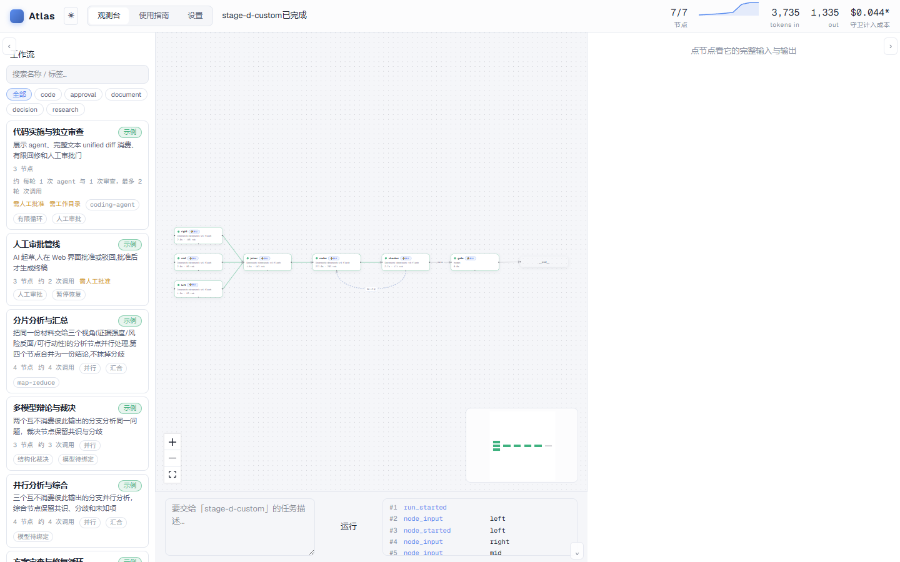
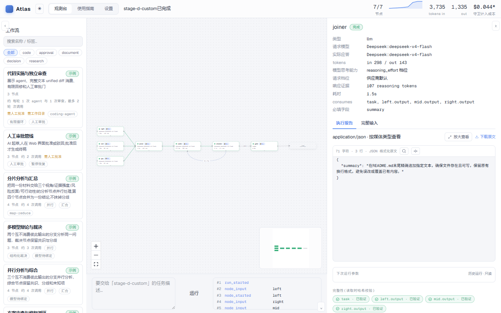

# Atlas

[中文](README.md) · **English**

    

Atlas is a multi-model workflow engine that runs on your local Windows machine: you describe a directed graph in YAML, different vendors' models play different roles — parallel research, cross review, code changes, human sign-off — and the complete input and output of every node lands on your own disk in real time.

It addresses one concrete problem: when you chain multiple LLM calls into a pipeline, "looks successful" and "is successful" are different things. Atlas runs fake-success detection on every call (empty output, truncation, and missing fields all fail), hash assertions on every artifact, and bookkeeping on every cent spent. When something breaks, you can see which step, which model, and why.



Click any node to see its full input projection, output artifact, the model actually used, tokens, and duration. When a run pauses at a human gate, the approval bar lists the exact materials under review plus the full projection (with hashes) — approve binds that material by hash, and rejecting requires a stated reason.



## What it looks like

A graph = one YAML file. For example, three perspectives analyzed in parallel, synthesized, handed to a coding agent, then approved by a human:

```yaml
name: stage-d-custom
nodes:
  - { id: left,  type: llm, model: Deepseek:deepseek-v4-flash,
      prompt: "Give one aspect of the task", consumes: [task] }
  - { id: mid,   type: llm, model: Deepseek:deepseek-v4-flash,
      prompt: "Give another aspect",         consumes: [task] }
  - { id: right, type: llm, model: Deepseek:deepseek-v4-flash,
      prompt: "Give a third aspect",         consumes: [task] }
  - { id: joiner, type: llm, model: Deepseek:deepseek-v4-flash,
      prompt: "Synthesize into an executive summary",
      consumes: [task, left.output, mid.output, right.output] }
  - { id: coder,  type: coding_agent, workdir: demo-project,
      prompt: "Implement per the summary and self-test", consumes: [task, joiner.output] }
  - { id: checker, type: llm, model: Deepseek:deepseek-v4-flash,
      prompt: "Verify the diff matches the task, output verdict", consumes: [task, coder.diff] }
  - { id: gate, type: human, prompt: "Review the change and verdict, approve or reject" }
edges:
  - { from: left,  to: joiner }
  - { from: mid,   to: joiner }
  - { from: right, to: joiner }
  - { from: joiner, to: coder }
  - { from: coder,  to: checker }
  - { from: checker, to: gate }
  - { from: gate, to: END }
guards:
  timeout_s: 1800
```

This is a record of a real run (2026-08-19, DeepSeek deepseek-v4-flash): all 7 nodes completed, the coding agent appended exactly the requested line to the demo project's README, the diff review returned pass, and the run finished after human approval. Total time 4m44s, known cost **$0.0442** — every node's tokens, duration, and cost are itemized in the ledger.

## Real case studies

All come from real provider API runs before release — including failures, because failures are part of the record too.

**Repair loop + code review + human gate** (the `code-change-review-approve` example, SuperAI doubao-seed-2.0-lite). Task: "fix the sample bug in demo-project and self-test". Round one: the implementer fixed the fizzbuzz ordering bug but also created two unrelated files and never actually ran the tests; the reviewer returned a structured `repair` verdict with an issue list. Round two: the implementer cleaned up; the reviewer returned `pass`. Human approval ended the run. Two rounds cost $0.96 total, with both diffs archived as downloadable artifacts. (Honest note: back edges do not carry reviewer feedback today — round two re-implemented from the frozen baseline; feedback-carrying loops are on the backlog.)

**10-node custom graph, run straight from MCP** (2026-08-22, four models across DeepSeek and SuperAI). Describe the goal to an AI assistant with the Atlas skill loaded and it writes the graph on the spot: three parallel scouts → synthesis → structured review (conditional routing) → a revision branch that consumes the review → re-review → final edit → **human approval** → a post-gate closer. The whole graph ran via the `yaml` argument of `atlas_run_workflow` over the MCP HTTP endpoint, never touching disk. All 8 executed nodes passed on the first attempt (review returned pass immediately); total wall time 361s of which 294s were human wait, about $0.01, and every artifact hash re-verified independently afterwards.

**Honestly recorded failures**. The same test matrix also produced: reasoning models burning their entire output budget on thinking, leaving visible text empty (caught by the empty-output check); a prompt only 1% delivered (caught by the truncation sentinel); and an agent attempt self-reporting ~$10.50 whose automatic retry was manually killed — that incident directly motivated today's cost reservation mechanism and the rule that every real agent run must carry a budget. The full matrix is documented in [`docs/STATUS.md`](docs/STATUS.md).

## Quick start

Requires Windows 10/11 x64, Python 3.12, and [uv](https://docs.astral.sh/uv/). Git-clone users also need Node.js 22.12+ to build the frontend once; the official Release bundle ships a prebuilt frontend that `atlas-web` picks up automatically (override with `--dist` or the `ATLAS_WEB_DIST` env var).

```powershell
git clone https://github.com/Ctrl1CandV/Atlas.git
cd Atlas
uv sync --locked --all-groups
npm --prefix web ci
npm --prefix web run build
uv run atlas-web
```

One command starts both the Web UI (<http://127.0.0.1:8321>) and the MCP endpoint (`http://127.0.0.1:8321/mcp`). Point Claude Code / ZCode / Cursor at that URL and your AI assistant can write graphs, validate, preview, and run for you; the repo's `.mcp.json` points at the same endpoint. Setup details in [`docs/mcp.md`](docs/mcp.md).

First start generates local configuration from templates (never overwriting existing files); credentials live only in `config/.env`. The six bundled examples (parallel synthesis, debate judge, map-reduce, retry loop, human approval pipeline, code-change review) validate and preview out of the box; bind your configured models before any real run.

## Design principles

- **Preview before paying**: `validate` and `dry_run` are free; dry-run renders the exact effective spec a real run would use, bound by hash.
- **Integrity first**: artifacts travel by reference (file + SHA-256) with read-back assertion; missing inputs fail loudly instead of feeding downstream nodes empty strings; oversized input errors out rather than truncating.
- **Fake success degrades**: HTTP 200 is not success. Empty output, truncation, or missing required fields trigger a cross-vendor fallback chain, with degradation explicitly labeled.
- **Auditable end to end**: an append-only JSONL event ledger is the single source of truth; everything the UI shows can be traced to it; approval evidence binds baseline/result/patch digests.
- **Crash-recoverable**: if the controller dies, the run becomes interrupted; resuming re-executes only unfinished nodes without double-counting reserved budget.
- **Human in the loop**: `human` nodes pause the graph in the UI; the approval bar lists the materials under review and the full projection (hashed, one click to open), and rejecting requires a stated reason.

## Capabilities and limits (stated plainly)

- Windows 10/11 x64 only; distributed as a source sdist, not on PyPI, no prebuilt installer. Current stable version `v0.1.0`; Git clone and sdist contents differ slightly (see the [release notes](https://github.com/Ctrl1CandV/Atlas/releases/tag/v0.1.0)).
- The Web binds to loopback only, with no multi-user auth; do not expose it.
- Coding agents run through Claude CLI as a **same-user host process** (requires explicit `"runner": "local_cli"` in `config/agents.json`; the provider must supply `anthropicBaseUrl` and credentials). A directory copy is not an OS sandbox: the process can theoretically reach every host path available to that user. `allowed_paths` and loopback binding are not security boundaries. Atlas does not write the original directory; diffs are complete textual unified diffs generated from frozen-baseline ordinary-file byte manifests, and binary changes fail loudly. Approval evidence binds `baseline_digest`, `result_digest`, and `patch_digest`.
- `allow_web: false` only withholds Claude CLI's WebSearch/WebFetch tools; a writable agent has Bash and may still reach the network. `max_turns` remains a validated spec field, but the current Claude CLI has no hard turn-count parameter; hard limits come from deadlines and configured budgets.
- Research and coding-agent nodes never auto-rerun by default (`retry` defaults to 0); once `retry: N` is declared explicitly, dry-run must surface the amplification-risk warning.
- Cost caps are exact only where prices are known; unknown prices conservatively consume remaining budget locally but cannot prove the provider's actual bill stayed under the cap.
- Names like "multi-vendor debate" describe topology only; opinions are independent only when genuinely distinct providers are bound.

## Testing and verification

2026-08-27 baseline: Python tests **664 passed / 2 skipped** (plus 5 real-provider tests excluded by default — opt-in and possibly billable); Web tests 22 passed, lint clean, production build OK; public CI passes both jobs on main. A 10-node custom graph ran end-to-end over the MCP HTTP endpoint including human approval (see the real runs above).

2026-08-19 release baseline: Python tests **427 passed** (plus 5 real-provider tests excluded by default — opt-in and possibly billable); Web tests 22 passed, lint clean, production build OK; strict offline validate/dry-run of all six example workflows with 0 provider calls; release sdist scanned at 100 entries with 0 findings. These numbers describe that source state; see [`docs/STATUS.md`](docs/STATUS.md).

Development checks:

```powershell
uv lock --check
uv run python -m compileall -q atlas
uv run pytest
npm --prefix web test && npm --prefix web run lint && npm --prefix web run build
```

## Documentation

- [`docs/STATUS.md`](docs/STATUS.md) — entry point for current product and release facts
- [`docs/ROADMAP.md`](docs/ROADMAP.md) — unimplemented features and sequencing
- [`docs/mcp.md`](docs/mcp.md) — harness setup configs
- [`skill/SKILL.md`](skill/SKILL.md) — operating manual for AI assistants
- [`SECURITY.md`](SECURITY.md) · [`CONTRIBUTING.md`](CONTRIBUTING.md) · [`CHANGELOG.md`](CHANGELOG.md)

## License

Apache License 2.0. See [`LICENSE`](LICENSE) and [`NOTICE`](NOTICE).
